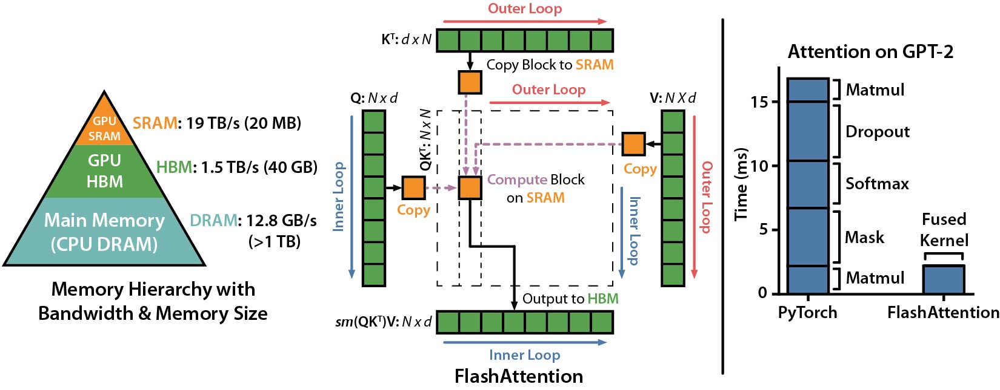

# FlashAttention
This repository provides the official implementation of FlashAttention from the
following paper.

**FlashAttention: Fast and Memory-Efficient Exact Attention with IO-Awareness**  
Tri Dao, Daniel Y. Fu, Stefano Ermon, Atri Rudra, Christopher Ré


## Alpha release (0.1).

To compile (requiring NVCC and an A100 GPU):
```
cd csrc/flash_attn
python setup.py install
```

Interface: `src/flash_attention.py`

To run the benchmark against PyTorch standard attention: 
```
PYTHONPATH=$PWD python benchmarks/benchmark_flash_attention.py
```

FlashAttention currently supports:
1. A100 GPUs.
2. fp16.
3. Head dimensions 16, 32, 64.

Our tentative roadmap:
1. [Jun 2022] Make package pip-installable.
2. [Jun 2022] Support SM86 GPUs (e.g., RTX 3080, 3090).
3. [Jun 2022] Refactor to use Cutlass.
4. [Jun 2022] Support SM75 GPUs (e.g. T4).
5. [Jun 2022] Support bf16.
6. [Jul 2022] Support head dimension 128.
7. [Jul 2022] Support SM70 GPUs (V100).
8. [Aug 2022] Fuse rotary embedding.
9. [Aug 2022] Support Attention linear bias (e.g. ALiBi).

## Speedup and Memory Savings

We present expected speedup (combined forward + backward pass) and memory savings from using FlashAttention against PyTorch standard attention, depending on sequence length.
We display FlashAttention speedup using these parameters (similar to BERT-base):
* Batch size 8
* Head dimension 64
* 12 attention heads

Our graphs show sequence lengths between 128 and 4096 (when standard attention runs out of memory on an A100), but FlashAttention can scale up to sequence length 64K.

### Speedup


We generally see 2-4X speedup at sequence lengths between 128 and 4K, and we see more speedup when using dropout and masking, since we fuse the kernels.
At sequence lengths that are popular with language models like 512 and 1K, we see speedups up to 4X when using dropout and masking.

### Memory


We show memory savings in this graph (note that memory footprint is the same no matter if you use dropout or masking).
Memory savings are proportional to sequence length -- since standard attention has memory quadratic in sequence length, whereas FlashAttention has memory linear in sequence length.
We see 10X memory savings at sequence length 2K, and 20X at 4K.
As a result, FlashAttention can scale to much longer sequence lengths.

## Acknowledgments
Our implementation uses Apex's
[FMHA](https://github.com/NVIDIA/apex/tree/master/apex/contrib/csrc/fmha) code
as a starting point.

We thank [Young-Jun Ko](https://yjk21.github.io/) for the in-depth explanation of his FMHA implementation
and for his thoughtful answers to our questions about CUDA.
