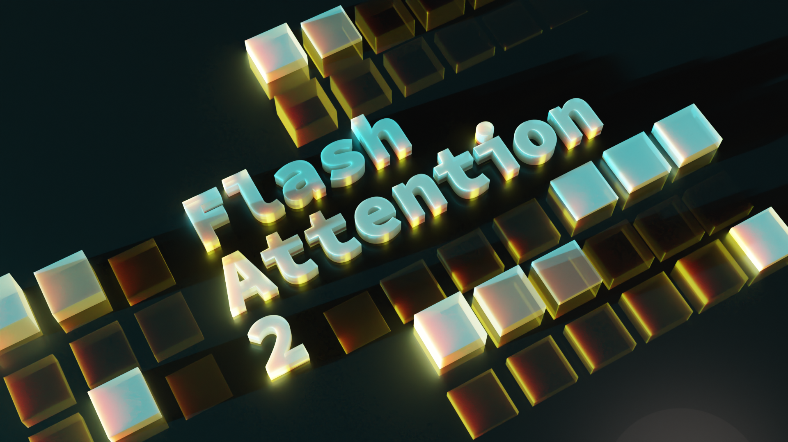

# FlashAttention
This repository provides the official implementation of FlashAttention and
FlashAttention-2 from the
following papers.

**FlashAttention: Fast and Memory-Efficient Exact Attention with IO-Awareness**  
Tri Dao, Daniel Y. Fu, Stefano Ermon, Atri Rudra, Christopher Ré  
Paper: https://arxiv.org/abs/2205.14135  
IEEE Spectrum [article](https://spectrum.ieee.org/mlperf-rankings-2022) about our submission to the MLPerf 2.0 benchmark using FlashAttention.


**FlashAttention-2: Faster Attention with Better Parallelism and Work Partitioning**  
Tri Dao

Paper: https://tridao.me/publications/flash2/flash2.pdf




## Usage

We've been very happy to see FlashAttention being widely adopted in such a short
time after its release. This [page](https://github.com/Dao-AILab/flash-attention/blob/main/usage.md)
contains a partial list of places where FlashAttention is being used.

FlashAttention and FlashAttention-2 are free to use and modify (see LICENSE).
Please cite and credit FlashAttention if you use it.

## Installation and features

Requirements:
- CUDA 11.4 and above.
- PyTorch 1.12 and above.

We recommend the
[Pytorch](https://catalog.ngc.nvidia.com/orgs/nvidia/containers/pytorch)
container from Nvidia, which has all the required tools to install FlashAttention.

To install:
1. Make sure that PyTorch is installed.
2. Make sure that `packaging` is installed (`pip install packaging`)
3. Make sure that `ninja` is installed and that it works correctly (e.g. `ninja
--version` then `echo $?` should return exit code 0). If not (sometimes `ninja
--version` then `echo $?` returns a nonzero exit code), uninstall then reinstall
`ninja` (`pip uninstall -y ninja && pip install ninja`). Without `ninja`,
compiling can take a very long time (2h) since it does not use multiple CPU
cores. With `ninja` compiling takes 3-5 minutes on a 64-core machine.
4. Then:
```sh
pip install flash-attn --no-build-isolation
```
Alternatively you can compile from source:
```sh
python setup.py install
```

If your machine has less than 96GB of RAM and lots of CPU cores, `ninja` might
run too many parallel compilation jobs that could exhaust the amount of RAM. To
limit the number of parallel compilation jobs, you can set the environment
variable `MAX_JOBS`:
```sh
MAX_JOBS=4 pip install flash-attn --no-build-isolation
```

Interface: `src/flash_attention_interface.py`

FlashAttention-2 currently supports:
1. Ampere, Ada, or Hopper GPUs (e.g., A100, RTX 3090, RTX 4090, H100). Support for Turing
   GPUs (T4, RTX 2080) is coming soon, please use FlashAttention 1.x for Turing
   GPUs for now.
2. Datatype fp16 and bf16 (bf16 requires Ampere, Ada, or Hopper GPUs).
3. All head dimensions up to 256. Head dim > 192 backward requires A100/A800 or H100/H800.


## How to use FlashAttention

The main functions implement scaled dot product attention (softmax(Q @ K^T *
softmax_scale) @ V):
```python
from flash_attn import flash_attn_qkvpacked_func, flash_attn_func
```

```python
flash_attn_qkvpacked_func(qkv, dropout_p=0.0, softmax_scale=None, causal=False):
"""dropout_p should be set to 0.0 during evaluation
If Q, K, V are already stacked into 1 tensor, this function will be faster than
calling flash_attn_func on Q, K, V since the backward pass avoids explicit concatenation
of the gradients of Q, K, V.
Arguments:
    qkv: (batch_size, seqlen, 3, nheads, headdim)
    dropout_p: float. Dropout probability.
    softmax_scale: float. The scaling of QK^T before applying softmax.
        Default to 1 / sqrt(headdim).
    causal: bool. Whether to apply causal attention mask (e.g., for auto-regressive modeling).
Return:
    out: (batch_size, seqlen, nheads, headdim).
"""
```

```python
flash_attn_func(q, k, v, dropout_p=0.0, softmax_scale=None, causal=False):
"""dropout_p should be set to 0.0 during evaluation
Supports multi-query and grouped-query attention (MQA/GQA) by passing in KV with fewer heads
than Q. Note that the number of heads in Q must be divisible by the number of heads in KV.
For example, if Q has 6 heads and K, V have 2 heads, head 0, 1, 2 of Q will attention to head
0 of K, V, and head 3, 4, 5 of Q will attention to head 1 of K, V.

Arguments:
    q: (batch_size, seqlen, nheads, headdim)
    k: (batch_size, seqlen, nheads_k, headdim)
    v: (batch_size, seqlen, nheads_k, headdim)
    dropout_p: float. Dropout probability.
    softmax_scale: float. The scaling of QK^T before applying softmax.
        Default to 1 / sqrt(headdim).
    causal: bool. Whether to apply causal attention mask (e.g., for auto-regressive modeling).
Return:
    out: (batch_size, seqlen, nheads, headdim).
"""
```

To see how these functions are used in a multi-head attention layer (which
includes QKV projection, output projection), see the MHA [implementation](https://github.com/Dao-AILab/flash-attention/blob/main/flash_attn/modules/mha.py).

## Upgrading from FlashAttention (1.x) to FlashAttention-2

These functions have been renamed:
- `flash_attn_unpadded_func` -> `flash_attn_varlen_func`
- `flash_attn_unpadded_qkvpacked_func` -> `flash_attn_varlen_qkvpacked_func`
- `flash_attn_unpadded_kvpacked_func` -> `flash_attn_varlen_kvpacked_func`

If the inputs have the same sequence lengths in the same batch, it is simpler
and faster to use these functions:
```python
flash_attn_qkvpacked_func(qkv, dropout_p=0.0, softmax_scale=None, causal=False)
```
```python
flash_attn_func(q, k, v, dropout_p=0.0, softmax_scale=None, causal=False)
```
## Changes in v2.1 (compared to v2.0)

If seqlen_q != seqlen_k and causal=True, the causal mask is aligned to the
bottom right corner of the attention matrix, instead of the top-left corner.

For example, if seqlen_q = 2 and seqlen_k = 5, the causal mask (1 = keep, 0 =
masked out) is:  
v2.0:  
    1 0 0 0 0  
    1 1 0 0 0  
v2.1:  
    1 1 1 1 0  
    1 1 1 1 1  

If seqlen_q = 5 and seqlen_k = 2, the causal mask is:  
v2.0:  
    1 0  
    1 1  
    1 1  
    1 1  
    1 1  
v2.1:  
    0 0  
    0 0  
    0 0  
    1 0  
    1 1  
If the row of the mask is all zero, the output will be zero.

## Performance

We present expected speedup (combined forward + backward pass) and memory savings from using FlashAttention against PyTorch standard attention, depending on sequence length, on different GPUs (speedup depends on memory bandwidth - we see more speedup on slower GPU memory).

We currently have benchmarks for these GPUs:
* [A100](#a100)
* [H100](#h100)
<!-- * [RTX 3090](#rtx-3090) -->
<!-- * [T4](#t4) -->

### A100

We display FlashAttention speedup using these parameters:
* Head dimension 64 or 128, hidden dimension 2048 (i.e. either 32 or 16 heads).
* Sequence length 512, 1k, 2k, 4k, 8k, 16k.
* Batch size set to 16k / seqlen.

#### Speedup


#### Memory


We show memory savings in this graph (note that memory footprint is the same no matter if you use dropout or masking).
Memory savings are proportional to sequence length -- since standard attention has memory quadratic in sequence length, whereas FlashAttention has memory linear in sequence length.
We see 10X memory savings at sequence length 2K, and 20X at 4K.
As a result, FlashAttention can scale to much longer sequence lengths.

### H100


## Full model code and training script

We have released the full GPT model
[implementation](https://github.com/Dao-AILab/flash-attention/blob/main/flash_attn/models/gpt.py).
We also provide optimized implementations of other layers (e.g., MLP, LayerNorm,
cross-entropy loss, rotary embedding). Overall this speeds up training by 3-5x
compared to the baseline implementation from Huggingface, reaching up to 225
TFLOPs/sec per A100, equivalent to 72% model FLOPs utilization (we don't need
any activation checkpointing).

We also include a training
[script](https://github.com/Dao-AILab/flash-attention/tree/main/training) to
train GPT2 on Openwebtext and GPT3 on The Pile.

## Triton implementation of FlashAttention

Phil Tillet (OpenAI) has an experimental implementation of FlashAttention in Triton:
https://github.com/openai/triton/blob/master/python/tutorials/06-fused-attention.py

As Triton is a higher-level language than CUDA, it might be easier to understand
and experiment with. The notations in the Triton implementation are also closer
to what's used in our paper.

We also have an experimental implementation in Triton that support attention
bias (e.g. ALiBi):
https://github.com/Dao-AILab/flash-attention/blob/main/flash_attn/flash_attn_triton.py


## Tests
We test that FlashAttention produces the same output and gradient as a reference
implementation, up to some numerical tolerance. In particular, we check that the
maximum numerical error of FlashAttention is at most twice the numerical error
of a baseline implementation in Pytorch (for different head dimensions, input
dtype, sequence length, causal / non-causal).

To run the tests:
```sh
pytest -q -s tests/test_flash_attn.py
```
## When you encounter issues

This new release of FlashAttention-2 has been tested on several GPT-style
models, mostly on A100 GPUs.

If you encounter bugs, please open a GitHub Issue!

## Citation
If you use this codebase, or otherwise found our work valuable, please cite:
```
@inproceedings{dao2022flashattention,
  title={Flash{A}ttention: Fast and Memory-Efficient Exact Attention with {IO}-Awareness},
  author={Dao, Tri and Fu, Daniel Y. and Ermon, Stefano and Rudra, Atri and R{\'e}, Christopher},
  booktitle={Advances in Neural Information Processing Systems},
  year={2022}
}
@article{dao2023flashattention2,
  title={Flash{A}ttention-2: Faster Attention with Better Parallelism and Work Partitioning},
  author={Dao, Tri},
  year={2023}
}
```
