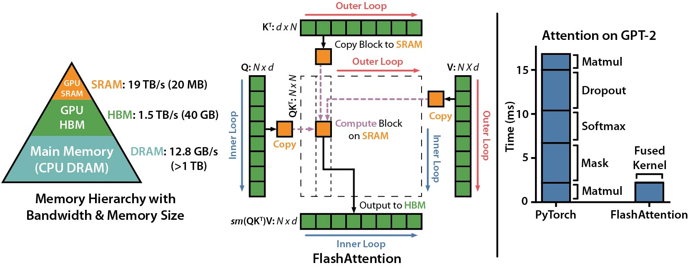

# FlashAttention

<p align="center">
  <a href="README.md">English</a> · <b>简体中文</b>
</p>

本仓库提供了以下论文中 **FlashAttention** 与 **FlashAttention-2** 的官方实现。

**FlashAttention: Fast and Memory-Efficient Exact Attention with IO-Awareness**（IO 感知的高速显存高效精确注意力机制）  
Tri Dao, Daniel Y. Fu, Stefano Ermon, Atri Rudra, Christopher Ré  
论文：https://arxiv.org/abs/2205.14135  
IEEE Spectrum 关于我们使用 FlashAttention 提交 MLPerf 2.0 基准测试的[报道文章](https://spectrum.ieee.org/mlperf-rankings-2022)。  


**FlashAttention-2: Faster Attention with Better Parallelism and Work Partitioning**（具有更佳并行性与任务划分的更快注意力机制）  
Tri Dao  

论文：https://tridao.me/publications/flash2/flash2.pdf  


## 使用情况 (Usage)

我们非常欣喜地看到 FlashAttention 在发布后如此短的时间内被业界广泛采纳。此[页面](https://github.com/Dao-AILab/flash-attention/blob/main/usage.md)列出了部分采用 FlashAttention 的开源项目与企业列表。

FlashAttention 与 FlashAttention-2 可免费使用和修改（参见 LICENSE）。如在学术研究或产品中使用了本项目，请务必引用并注明出处。


## FlashAttention-3 测试版发布 (Beta Release)
FlashAttention-3 专门针对 Hopper 架构 GPU（如 H100）进行了深度优化。

博客文章：https://tridao.me/blog/2024/flash3/

论文：https://tridao.me/publications/flash3/flash3.pdf


当前为测试版（Beta），供社区测试与基准评测，后续我们将全面集成到主仓库中。

当前已支持特性：
- FP16 / BF16 前向（Forward）与反向（Backward）计算，FP8 前向计算

环境要求：H100 / H800 GPU，CUDA >= 12.3。

强烈推荐使用 **CUDA 12.8** 以获取极致性能。

安装方式：
```sh
cd hopper
python setup.py install
```
运行测试：
```sh
export PYTHONPATH=$PWD
pytest -q -s test_flash_attn.py
```
安装完成后，可通过如下方式导入使用：
```python
from flash_attn_3 import flash_attn_interface
flash_attn_interface.flash_attn_func()
```

若使用 `uv` 管理依赖，可在 `pyproject.toml` 中配置：

```toml
[project]
dependencies = [
    "flash-attn-3"
]

[tool.uv]
no-build-isolation = true

[tool.uv.sources]
flash-attn-3 = { git = "https://github.com/Dao-AILab/flash-attention", subdirectory = "hopper" }
```

## FlashAttention-4 (CuTeDSL)

FlashAttention-4 使用 CuTeDSL 编写，专为 Hopper 和 Blackwell 架构 GPU（如 H100、B200）深度优化。

安装方式：
```sh
pip install flash-attn-4
```

若使用 CUDA 13，建议通过 `cu13` 额外依赖包安装以获得最佳性能：
```sh
pip install "flash-attn-4[cu13]"
```

安装完成后，即可按如下方式调用：
```python
from flash_attn.cute import flash_attn_func

out = flash_attn_func(q, k, v, causal=True)
```

## 安装与特性支持 (Installation and features)
**系统与依赖要求：**
- CUDA 工具包（CUDA toolkit）或 ROCm 工具包
- PyTorch 2.2 及以上版本
- `packaging` Python 包（`pip install packaging`）
- `psutil` Python 包（`pip install psutil`）
- `ninja` Python 包（`pip install ninja`）*
- Linux 系统。从 v2.3.2 开始可能支持 Windows（社区有一些积极[反馈](https://github.com/Dao-AILab/flash-attention/issues/595)），但 Windows 下的编译仍需更多测试验证。如果您对构建适用于 Windows 的预编译 CUDA Wheel 包有建设性思路，欢迎提交 GitHub Issue 与我们联系。

\* 务必确保已安装 `ninja` 并且能够正常运行（例如执行 `ninja --version` 后执行 `echo $?` 应返回退出码 0）。如果异常（有时 `ninja --version` 后 `echo $?` 返回非零退出码），请卸载后重新安装（`pip uninstall -y ninja && pip install ninja`）。若缺少 `ninja`，编译过程将无法利用多 CPU 核心并行构建，耗时可能长达 2 小时；在使用 CUDA 工具包且包含 `ninja` 的 64 核机器上，编译通常仅需 3-5 分钟。

**安装命令：**
```sh
pip install flash-attn --no-build-isolation
```
或者从源码编译安装：
```sh
python setup.py install
```

如果机器内存小于 96GB 且拥有较多 CPU 核心，`ninja` 可能会启动过多的并行编译任务而导致内存耗尽（OOM）。您可以通过设置环境变量 `MAX_JOBS` 来限制并行编译任务数：
```sh
MAX_JOBS=4 pip install flash-attn --no-build-isolation
```

**核心接口源码文件：** `src/flash_attention_interface.py`

### NVIDIA CUDA 支持
**环境要求：**
- CUDA 12.0 及以上版本。

推荐使用来自 NVIDIA 的 [PyTorch 容器镜像](https://catalog.ngc.nvidia.com/orgs/nvidia/containers/pytorch)，其内置了安装 FlashAttention 所需的全部编译工具链。

FlashAttention-2 CUDA 后端当前支持：
1. Ampere、Ada 或 Hopper 架构 GPU（例如 A100、RTX 3090、RTX 4090、H100）。对于 Turing 架构 GPU（如 T4、RTX 2080），请参考独立的 [flash-attention-turing](https://github.com/ssiu/flash-attention-turing) 仓库，该项目支持 Turing 架构上的核心 FlashAttention 特性子集。
2. 数据类型支持 `fp16` 和 `bf16`（`bf16` 需要 Ampere、Ada 或 Hopper 架构 GPU 支持）。
3. 支持最大达 256 的所有注意力头维度（Head Dimension）。~~此前反向传播中 Head Dim > 192 需要 A100/A800 或 H100/H800~~。自 flash-attn 2.5.5 起，在未启用 dropout 的情况下，Head Dim 256 的反向传播已支持在消费级显卡上正常运行。

### AMD ROCm 支持
ROCm 版本提供两种后端支持：默认的 [composable_kernel](https://github.com/ROCm/composable_kernel) (CK) 后端，以及 [Triton](https://github.com/triton-lang/triton) 后端。两者均提供了 FlashAttention-2 的高效实现。

**环境要求：**
- ROCm 6.0 及以上版本。

推荐使用来自 ROCm 的 [PyTorch 容器镜像](https://hub.docker.com/r/rocm/pytorch)，其内置了安装 FlashAttention 所需的全部环境。

#### Composable Kernel (CK) 后端
FlashAttention-2 ROCm CK 后端当前支持：
1. MI200x、MI250x、MI300x、MI355x 以及 RDNA 3/4 系列 GPU。
2. 数据类型支持 `fp16` 与 `bf16`。
3. 前向与反向计算均支持最大达 256 的 Head Dimension。

#### Triton 后端
基于 Triton 实现的 [Flash Attention](https://tridao.me/publications/flash2/flash2.pdf) 支持 AMD CDNA（MI200、MI300）及 RDNA 架构 GPU，支持 `fp16`、`bf16` 和 `fp32` 数据类型。该实现支持因果掩码（Causal Masking）、变长序列（Variable Sequence Lengths）、任意 Q/KV 序列长度与头维度大小、MQA/GQA、Dropout、旋转位置编码（Rotary Embeddings）、ALiBi、分页注意力（Paged Attention）以及 FP8（通过 Flash Attention v3 接口）。滑动窗口注意力目前正在开发支持中。

Triton 后端算子由 [aiter](https://github.com/ROCm/aiter) 软件包提供，作为 Git 子模块引入于 `third_party/aiter`，并在构建安装期间自动安装。

安装时，请先从 https://pytorch.org/get-started/locally/ 安装适用于 ROCm 的 PyTorch，然后安装 Flash Attention：
```sh
cd flash-attention
FLASH_ATTENTION_TRITON_AMD_ENABLE="TRUE" pip install --no-build-isolation .
```

若需指定特定的 aiter commit 版本（用于测试或开发）：
```sh
cd flash-attention
cd third_party/aiter && git fetch origin && git checkout <commit-sha> && cd ../..
FLASH_ATTENTION_TRITON_AMD_ENABLE="TRUE" pip install --no-build-isolation .
```

运行测试套件（注意：完整测试耗时较长）：
```sh
FLASH_ATTENTION_TRITON_AMD_ENABLE="TRUE" pytest tests/test_flash_attn_triton_amd.py
```

Triton 后端使用一套默认的 Kernel 配置，针对确定性（Determinism）与常规负载下的性能进行了调优。为了获得极限吞吐量，可启用 `FLASH_ATTENTION_TRITON_AMD_AUTOTUNE="TRUE"` 自动搜索最佳算子配置（首次运行会产生一次预热开销）。

或者，在*未*开启自动调优时，可通过 `FLASH_ATTENTION_FWD_TRITON_AMD_CONFIG_JSON` 设置单独的 Triton 配置，以覆盖 `attn_fwd` 的内置默认参数，例如：
```sh
FLASH_ATTENTION_FWD_TRITON_AMD_CONFIG_JSON='{"BLOCK_M":128,"BLOCK_N":64,"waves_per_eu":1,"PRE_LOAD_V":false,"num_stages":1,"num_warps":8}'
```

使用 Docker 快速上手：
```dockerfile
FROM rocm/pytorch:latest

WORKDIR /workspace

# 基于 triton 后端构建 flash attention
RUN git clone https://github.com/Dao-AILab/flash-attention &&\ 
    cd flash-attention &&\
    FLASH_ATTENTION_TRITON_AMD_ENABLE="TRUE" pip install --no-build-isolation .

# 设置工作目录
WORKDIR /workspace/flash-attention

# 设置环境变量使用 triton 后端
ENV FLASH_ATTENTION_TRITON_AMD_ENABLE="TRUE"
```

构建与运行镜像：
```sh
docker build -t flash-attn-triton .
docker run -it --network=host --user root --group-add video --cap-add=SYS_PTRACE --security-opt seccomp=unconfined --ipc=host --shm-size 16G --device=/dev/kfd --device=/dev/dri flash-attn-triton
```

## 如何使用 FlashAttention (How to use FlashAttention)

核心函数实现了缩放点积注意力（Scaled Dot-Product Attention）：`softmax(Q @ K^T * softmax_scale) @ V`
```python
from flash_attn import flash_attn_qkvpacked_func, flash_attn_func
```

```python
flash_attn_qkvpacked_func(qkv, dropout_p=0.0, softmax_scale=None, causal=False,
                          window_size=(-1, -1), alibi_slopes=None, deterministic=False):
"""评估/推理阶段 dropout_p 应设为 0.0。
若 Q, K, V 已在显存中打包堆叠为一个张量，该函数的执行速度将快于在分离的 Q, K, V 上调用 flash_attn_func，
因为反向传播过程避免了对 Q, K, V 梯度的显式拼接操作。
当 window_size != (-1, -1) 时，启用滑动窗口局部注意力机制。位置 i 处的 Query
仅会关注 [i - window_size[0], i + window_size[1]] 范围（闭区间）内的 Key。

参数说明:
    qkv: (batch_size, seqlen, 3, nheads, headdim)
    dropout_p: float. Dropout 失活概率。
    softmax_scale: float. 在应用 Softmax 前对 QK^T 进行缩放的系数。
        默认为 1 / sqrt(headdim)。
    causal: bool. 是否应用因果掩码 (Causal Mask，如自回归语言建模)。
    window_size: (left, right). 若不为 (-1, -1)，则实现滑动窗口局部注意力。
    alibi_slopes: (nheads,) 或 (batch_size, nheads), fp32. 针对 query i 与 key j
        的注意力得分添加 (-alibi_slope * |i - j|) 偏置项。
    deterministic: bool. 是否在反向传播中使用确定性实现（计算略慢且消耗更多显存）。
        前向传播计算始终是确定性的。
返回值:
    out: (batch_size, seqlen, nheads, headdim)。
"""
```

```python
flash_attn_func(q, k, v, dropout_p=0.0, softmax_scale=None, causal=False,
                window_size=(-1, -1), alibi_slopes=None, deterministic=False):
"""评估/推理阶段 dropout_p 应设为 0.0。
支持多查询注意力 (MQA) 与分组查询注意力 (GQA)：传入头数少于 Q 的 KV 即可。
注意：Q 的注意力头数必须能被 KV 的头数整除。
例如，若 Q 拥有 6 个头，K 和 V 拥有 2 个头，则 Q 的第 0、1、2 头将关注 K、V 的第 0 头，
而 Q 的第 3、4、5 头将关注 K、V 的第 1 头。
当 window_size != (-1, -1) 时，实现滑动窗口局部注意力。位置 i 处的 Query
仅会关注以下闭区间内的 Key：
[i + seqlen_k - seqlen_q - window_size[0], i + seqlen_k - seqlen_q + window_size[1]]。

参数说明:
    q: (batch_size, seqlen, nheads, headdim)
    k: (batch_size, seqlen, nheads_k, headdim)
    v: (batch_size, seqlen, nheads_k, headdim)
    dropout_p: float. Dropout 失活概率。
    softmax_scale: float. 在应用 Softmax 前对 QK^T 进行缩放的系数。
        默认为 1 / sqrt(headdim)。
    causal: bool. 是否应用因果掩码 (Causal Mask，如自回归语言建模)。
    window_size: (left, right). 若不为 (-1, -1)，则实现滑动窗口局部注意力。
    alibi_slopes: (nheads,) 或 (batch_size, nheads), fp32. 针对 query i 与 key j
        添加 (-alibi_slope * |i + seqlen_k - seqlen_q - j|) 的偏置。
    deterministic: bool. 是否在反向传播中使用确定性实现（略慢且消耗更多显存）。
        前向传播计算始终是确定性的。
返回值:
    out: (batch_size, seqlen, nheads, headdim)。
"""
```

```python
def flash_attn_with_kvcache(
    q,
    k_cache,
    v_cache,
    k=None,
    v=None,
    rotary_cos=None,
    rotary_sin=None,
    cache_seqlens: Optional[Union[(int, torch.Tensor)]] = None,
    cache_batch_idx: Optional[torch.Tensor] = None,
    block_table: Optional[torch.Tensor] = None,
    softmax_scale=None,
    causal=False,
    window_size=(-1, -1),  # -1 表示无限上下文窗口
    rotary_interleaved=True,
    alibi_slopes=None,
):
    """
    若 k 与 v 不为 None，k_cache 和 v_cache 将被 k 与 v 的新值*原地 (inplace)* 更新。
    这对于增量自回归解码（Incremental Decoding）极其高效：您可以传入上一解码步缓存的 Keys/Values，
    并用当前步的新 Keys/Values 直接更新它们，同时在单个 Kernel 内完成注意力计算。

    若传入 k / v，必须确保 Cache 空间足够容纳新增值。
    例如，KV Cache 可以按最大序列长度预先分配，并使用 cache_seqlens 跟踪 Batch 中各个序列的当前实际长度。

    若传入 rotary_cos 与 rotary_sin，还将应用旋转位置编码 (RoPE)。Key @k 将在索引
    cache_seqlens, cache_seqlens + 1 等处被 rotary_cos 和 rotary_sin 进行旋转。
    若设置了因果 (causal) 或局部窗口 (window_size != (-1, -1))，Query @q 将在索引
    cache_seqlens, cache_seqlens + 1 等处进行旋转。
    若非因果且非局部窗口，Query @q 仅在索引 cache_seqlens 处进行旋转（即认为 @q 中所有 Token 均处于 cache_seqlens 位置）。

    使用范例请参考 tests/test_flash_attn.py::test_flash_attn_kvcache。

    支持多查询注意力 (MQA) 与分组查询注意力 (GQA)：传入头数少于 Q 的 KV 即可。
    注意：Q 的头数必须能被 KV 的头数整除。
    例如，若 Q 有 6 个头，K、V 有 2 个头，则 Q 的 0、1、2 头计算对应 K、V 的第 0 头，
    Q 的 3、4、5 头计算对应 K、V 的第 1 头。

    若 causal=True，因果掩码将向注意力矩阵的右下角对齐。
    例如，若 seqlen_q = 2 且 seqlen_k = 5，则因果掩码（1 = 保留，0 = 屏蔽）为：
        1 1 1 1 0
        1 1 1 1 1
    若 seqlen_q = 5 且 seqlen_k = 2，因果掩码为：
        0 0
        0 0
        0 0
        1 0
        1 1
    若某一行掩码全为 0，则该行对应输出为全 0。

    若 window_size != (-1, -1)，实现滑动窗口局部注意力。位置 i 处的 Query
    仅会关注以下闭区间内的 Key：
    [i + seqlen_k - seqlen_q - window_size[0], i + seqlen_k - seqlen_q + window_size[1]]。

    注意：此函数不支持反向传播。

    参数说明:
        q: (batch_size, seqlen, nheads, headdim)
        k_cache: 未使用 block_table 时为 (batch_size_cache, seqlen_cache, nheads_k, headdim)；
            使用 block_table（即分页 KV Cache）时为 (num_blocks, page_block_size, nheads_k, headdim)。
            page_block_size 必须是 256 的倍数。
        v_cache: 未使用 block_table 时为 (batch_size_cache, seqlen_cache, nheads_k, headdim)；
            使用 block_table 时为 (num_blocks, page_block_size, nheads_k, headdim)。
        k [可选]: (batch_size, seqlen_new, nheads_k, headdim)。若不为 None，
            将从 cache_seqlens 指定的索引开始将 k 拼接到 k_cache 中。
        v [可选]: (batch_size, seqlen_new, nheads_k, headdim)。类似于 k。
        rotary_cos [可选]: (seqlen_ro, rotary_dim / 2)。若不为 None，将对 k 和 q 应用旋转位置编码。
            仅在传入 k 和 v 时生效。rotary_dim 必须能被 16 整除。
        rotary_sin [可选]: (seqlen_ro, rotary_dim / 2)。类似于 rotary_cos。
        cache_seqlens: int 或 (batch_size,), dtype torch.int32。KV Cache 的实际序列长度。
        block_table [可选]: (batch_size, max_num_blocks_per_seq), dtype torch.int32。
        cache_batch_idx: (batch_size,), dtype torch.int32。索引进入 KV Cache 所用的批次索引。
            若为 None，默认批次索引为 [0, 1, 2, ..., batch_size - 1]。
            若索引不唯一且提供了 k 和 v，Cache 中更新的值可能来自任意重复的索引项。
        softmax_scale: float。Softmax 之前的缩放因子。默认为 1 / sqrt(headdim)。
        causal: bool。是否应用因果掩码。
        window_size: (left, right)。若不为 (-1, -1)，启用滑动窗口局部注意力。
        rotary_interleaved: bool。仅在提供 rotary_cos 与 rotary_sin 时生效。
            若为 True，旋转编码将组合维度 0 与 1、2 与 3 等；若为 False，
            旋转编码将组合维度 0 与 rotary_dim / 2、1 与 rotary_dim / 2 + 1（即 GPT-NeoX 风格）。
        alibi_slopes: (nheads,) 或 (batch_size, nheads), fp32。
            为 query i 与 key j 添加 (-alibi_slope * |i + seqlen_k - seqlen_q - j|) 偏置。

    返回值:
        out: (batch_size, seqlen, nheads, headdim)。
    """
```

若需了解这些函数如何在多头注意力层（Multi-Head Attention，包含 QKV 投影与输出投影）中完整使用，可参考 [MHA 实现源码](https://github.com/Dao-AILab/flash-attention/blob/main/flash_attn/modules/mha.py)。

### 结合 🤗 Kernels 快速使用

若您的硬件环境属于上述支持列表，亦可直接使用 Hugging Face 的 [`kernels` 库](https://github.com/huggingface/kernels) 即刻调用 Flash Attention 2 与 3：

```py
# pip install kernels

from kernels import get_kernel

# FA2
fa_module = get_kernel("kernels-community/flash-attn2", version=1)
flash_attn_func = fa_module.flash_attn_func

# FA3
fa3_module = get_kernel("kernels-community/flash-attn3", version=1)
flash_attn_func = fa3_module.flash_attn_func
```

## 更新日志 (Changelog)

### 2.0: 架构全面重写，提速 2 倍
从 FlashAttention (1.x) 升级到 FlashAttention-2：

重命名了以下接口函数：
- `flash_attn_unpadded_func` -> `flash_attn_varlen_func`
- `flash_attn_unpadded_qkvpacked_func` -> `flash_attn_varlen_qkvpacked_func`
- `flash_attn_unpadded_kvpacked_func` -> `flash_attn_varlen_kvpacked_func`

若同一 Batch 内所有输入具有相同的序列长度，调用如下函数更加简洁且性能更优：
```python
flash_attn_qkvpacked_func(qkv, dropout_p=0.0, softmax_scale=None, causal=False)
```
```python
flash_attn_func(q, k, v, dropout_p=0.0, softmax_scale=None, causal=False)
```

### 2.1: 因果掩码 (Causal Flag) 行为变更

当 `seqlen_q != seqlen_k` 且 `causal=True` 时，因果掩码由原来的**左上角对齐**调整为**向注意力矩阵右下角对齐**。

例如，当 `seqlen_q = 2` 且 `seqlen_k = 5` 时，因果掩码（1 = 保留，0 = 屏蔽）为：  
v2.0:  
    1 0 0 0 0  
    1 1 0 0 0  
v2.1:  
    1 1 1 1 0  
    1 1 1 1 1  

当 `seqlen_q = 5` 且 `seqlen_k = 2` 时，因果掩码为：  
v2.0:  
    1 0  
    1 1  
    1 1  
    1 1  
    1 1  
v2.1:  
    0 0  
    0 0  
    0 0  
    1 0  
    1 1  
若整行掩码全为 0，则输出结果全为 0。

### 2.2: 深度推理优化 (Inference Optimization)

针对 Query 序列长度极小（例如 query sequence length = 1 的自回归迭代解码）场景进行了深度推理优化。该场景的核心瓶颈在于尽可能快地从显存加载 KV Cache，我们通过将加载任务拆分到不同的线程块（Thread Blocks）中并行执行，并使用独立的 Kernel 合并结果。

更丰富的推理特性详见 `flash_attn_with_kvcache` 函数（支持旋转位置编码计算、KV Cache 原地更新）。

特别感谢 xformers 团队，尤其是 Daniel Haziza 在此功能上的紧密协作。

### 2.3: 局部注意力 (滑动窗口注意力)

实现滑动窗口局部注意力机制。感谢 [Mistral AI](https://mistral.ai/) 尤其是 Timothée Lacroix 的贡献。该滑动窗口机制被成功应用于 [Mistral 7B](https://mistral.ai/news/announcing-mistral-7b/) 模型中。

### 2.4: ALiBi 与确定性反向传播

- 支持带有线性偏差的注意力 ALiBi (Press et al., 2021)。感谢来自 Kakao Brain 的 Sanghun Cho 贡献此特性。
- 实现确定性反向传播（Deterministic Backward Pass）。感谢来自[美团](www.meituan.com)的工程师团队贡献此特性。

### 2.5: 分页 KV 缓存 (Paged KV Cache)

支持分页 KV 缓存（即 [PagedAttention](https://arxiv.org/abs/2309.06180)）。
感谢 @beginlner 贡献此特性。

### 2.6: Logit 软截断 (Softcapping)

支持注意力计算中的 Softcapping 机制，广泛应用于 Gemma-2 与 Grok 等前沿开源大模型。
感谢 @Narsil 与 @lucidrains 贡献此特性。

### 2.7: 兼容 torch.compile

完美支持 PyTorch 2.x 的 `torch.compile` 图编译优化。
感谢 @ani300 贡献此特性。

## 性能基准测试 (Performance)

下表展示了 FlashAttention 相比 PyTorch 标准注意力在不同序列长度和显卡架构下的预期加速比（包含前向与反向传播总耗时）及显存节省量（加速比与显存带宽相关——在显存带宽较慢的 GPU 上加速效果更加显著）。

目前我们提供了以下 GPU 的基准测试数据：
* [A100](#a100)
* [H100](#h100)
<!-- * [RTX 3090](#rtx-3090) -->
<!-- * [T4](#t4) -->

### A100

基准测试参数设置如下：
* Head Dimension 设为 64 或 128，隐藏层维度 Hidden Dimension 为 2048（即 32 或 16 个注意力头）。
* 序列长度分别为 512、1k、2k、4k、8k、16k。
* Batch Size 设为 `16k / seqlen`。

#### 加速比表现


#### 显存开销对比


上图展示了显存节省情况（无论是否使用 Dropout 或因果掩码，显存占用量均保持一致）。
显存节省幅度与序列长度成正比——因为标准注意力机制的显存复杂度与序列长度呈二次方关系（$O(N^2)$），而 FlashAttention 的显存复杂度仅与序列长度呈线性关系（$O(N)$）。
在 2K 序列长度下显存节省达 10 倍，在 4K 序列长度下可节省达 20 倍。
得益于此，FlashAttention 能够轻松扩展并支持极长上下文序列。

### H100


## 完整模型代码与训练脚本 (Full model code and training script)

我们开源了完整的 GPT 模型[参考实现](https://github.com/Dao-AILab/flash-attention/blob/main/flash_attn/models/gpt.py)。
同时还提供了其他网络层（如 MLP、LayerNorm、交叉熵损失 Cross-Entropy Loss、旋转位置编码 Rotary Embedding）的深度优化实现。相比 Hugging Face 官方 Baseline 实现，整体训练吞吐量可提升 3-5 倍，在单张 A100 上最高可达 225 TFLOPs/sec，相当于 72% 的模型计算峰值利用率（MFU，且全程无需任何激活重计算 Activation Checkpointing）。

仓库内还包含完整的训练[启动脚本](https://github.com/Dao-AILab/flash-attention/tree/main/training)，可用于在 OpenWebText 数据集上训练 GPT-2 以及在 The Pile 数据集上训练 GPT-3。

## FlashAttention 的 Triton 实现 (Triton implementation)

Phil Tillet (OpenAI) 提供了一个基于 Triton 编写的 FlashAttention 实验性实现：
https://github.com/openai/triton/blob/master/python/tutorials/06-fused-attention.py

由于 Triton 比 CUDA 语言层级更高，可能更加易于阅读、理解与定制实验。Triton 实现中的符号与我们论文中的公式表达也更加贴近。

我们同样提供了一个支持注意力偏置（如 ALiBi）的 Triton 实验性实现：
https://github.com/Dao-AILab/flash-attention/blob/main/flash_attn/flash_attn_triton.py


## 测试验证 (Tests)
在一定的数值误差容限范围内，我们验证了 FlashAttention 能够产生与基准实现完全一致的前向输出与反向梯度。特别是，我们严格检查确保 FlashAttention 的最大数值误差不超过 PyTorch 原生实现误差的 2 倍（覆盖不同的注意力头维度、输入数据类型、序列长度以及因果/非因果模式）。

运行测试命令：
```sh
pytest -q -s tests/test_flash_attn.py
```
运行 CK 后端测试：
```sh
pytest tests/test_flash_attn_ck.py
```

## 遇到问题反馈 (When you encounter issues)

FlashAttention-2 新版本已在多种主流 GPT 架构模型及 A100 GPU 环境下进行了充分验证。

若您在使用过程中发现任何 Bug，欢迎随时提交 GitHub Issue！

## 论文引用 (Citation)
如果您在学术研究或项目中使用了本项目，或发现我们的工作对您有所帮助，请引用以下论文：
```bibtex
@inproceedings{dao2022flashattention,
  title={Flash{A}ttention: Fast and Memory-Efficient Exact Attention with {IO}-Awareness},
  author={Dao, Tri and Fu, Daniel Y. and Ermon, Stefano and Rudra, Atri and R{\'e}, Christopher},
  booktitle={Advances in Neural Information Processing Systems (NeurIPS)},
  year={2022}
}
@inproceedings{dao2023flashattention2,
  title={Flash{A}ttention-2: Faster Attention with Better Parallelism and Work Partitioning},
  author={Dao, Tri},
  booktitle={International Conference on Learning Representations (ICLR)},
  year={2024}
}
```

---

> 💡 **文档维护说明**：本中文文档由社区志愿者（@JasonYeYuhe）翻译维护，最后同步更新于 2026年09月09日。如发现内容与官方英文原版存在差异或新特性滞后，欢迎提交 PR 共同完善！
